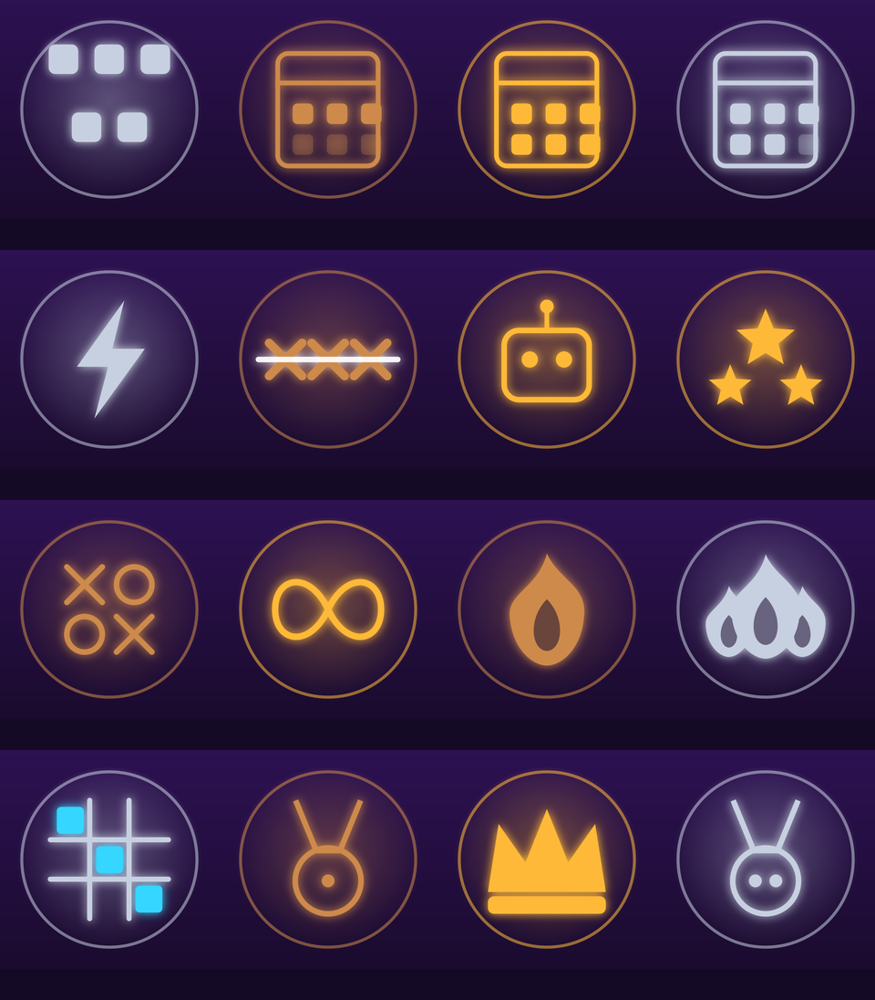

# Ícones das conquistas (512x512)

Gerados por `tool/make_achievement_icons.py` no estilo neon do app.
Regerar: `python3 tool/make_achievement_icons.py --out docs/achievement-icons`.

**Como subir:** Play Console -> Serviços de jogos do Play -> Conquistas -> abrir
cada conquista -> ícone. É manual: o endpoint de upload de imagem da Publishing
API responde **503** (o Google marcou essa parte como descontinuada), enquanto o
resto da API segue funcionando.

| Arquivo | Conquista (pt-BR) | Faixa |
|---|---|---|
| `first_win.png` | Primeira vitória | bronze |
| `wins_10.png` | Vitorioso | bronze |
| `wins_50.png` | Dominante | silver |
| `wins_200.png` | Lenda | gold |
| `streak_3.png` | Esquentando | bronze |
| `streak_7.png` | Pegando fogo | silver |
| `streak_15.png` | Imparável | gold |
| `hard_win.png` | Nem tão impossível | gold |
| `all_modes.png` | Explorador | silver |
| `ultimate_wins_10.png` | Mestre do tabuleirão | silver |
| `daily_3.png` | Rotina | bronze |
| `daily_7.png` | Semana cheia | silver |
| `daily_30.png` | Dedicado | gold |
| `fast_win.png` | Relâmpago | silver |
| `matches_50.png` | Veterano | bronze |
| `matches_250.png` | Maratonista | gold |

